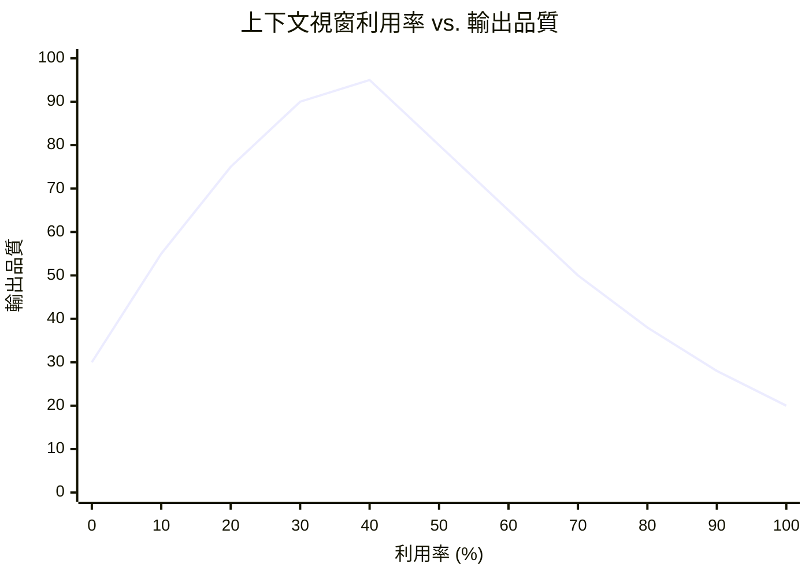
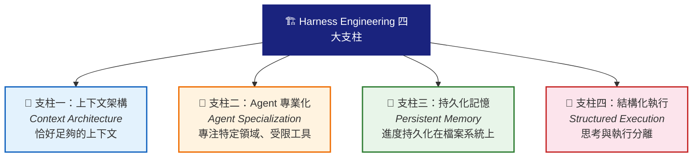
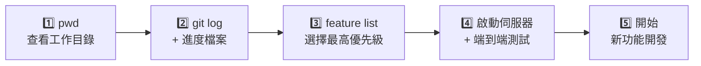
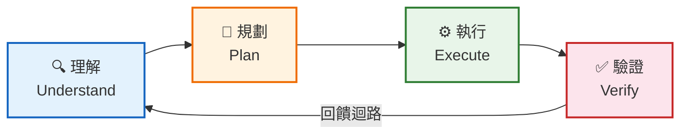
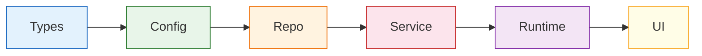
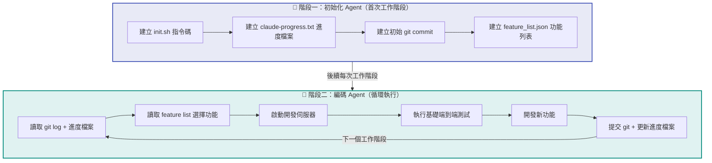
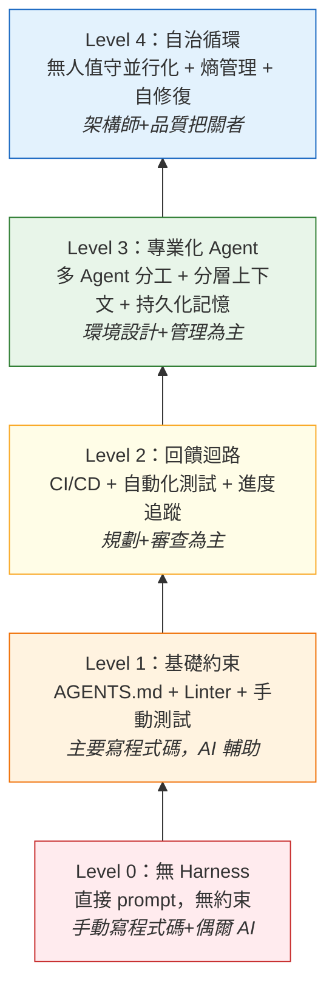
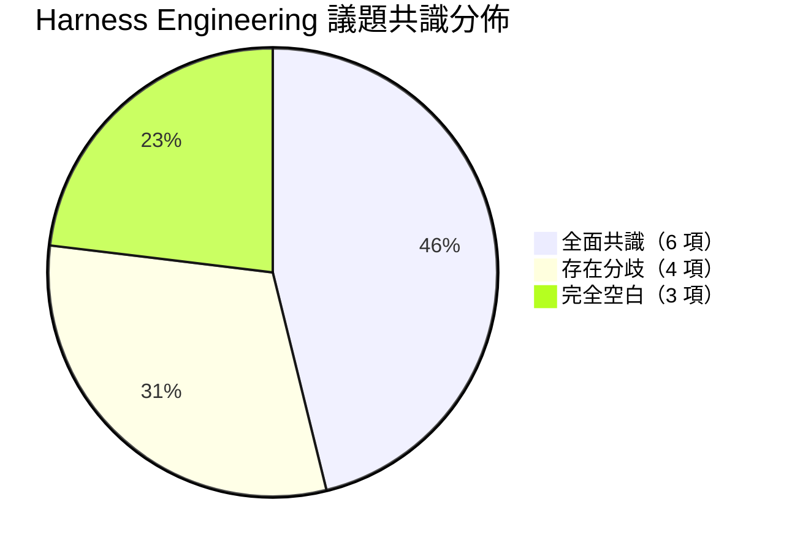

# Harness Engineering 深度解析：AI Agent 時代的工程範式革命

---

## 目錄

1. [什麼是 Harness Engineering](#第一部分什麼是-harness-engineering)
2. [為什麼需要 Harness Engineering](#第二部分為什麼需要-harness-engineering)
3. [四大支柱](#第三部分harness-engineering-的四大支柱)
4. [先進團隊的實戰案例](#第四部分先進團隊的實戰案例)
5. [Harness 核心組件詳解](#第五部分harness-的核心組件詳解)
6. [工程師角色的轉變](#第六部分工程師角色的轉變)
7. [業界趨勢與前瞻](#第七部分業界趨勢與前瞻)
8. [最佳實踐總結](#第八部分最佳實踐總結)
9. [開放問題與挑戰](#第九部分開放問題與挑戰)
10. [業界共識與分歧全景](#第十部分業界共識與分歧全景)
11. [參考文獻](#參考文獻與資料連結)

---

## 前言

2026 年 2 月，「Harness Engineering」這個詞突然在 AI 工程圈子裡爆紅。Mitchell Hashimoto 在部落格裡提了這個說法，OpenAI 緊接著發了百萬行程式碼的實驗報告，Martin Fowler 也跟進寫了深度分析——幾週之內，這個術語就成了討論 AI Agent 開發繞不開的話題。

本文把 Harness Engineering 的來龍去脈、核心方法和實戰經驗做了一次系統整理，重點拆解 OpenAI、Anthropic、Stripe 等團隊碰過的雷和沉澱下來的做法。最後，我們對 8 個獨立資訊來源進行交叉對比，梳理出業界已形成共識的六大方面、仍存分歧的四個議題，以及三個最值得探索的空白區。

---

## 第一部分：什麼是 Harness Engineering

### 1.1 定義

**Harness Engineering** 是指圍繞 AI Agent（特別是 Coding Agent）設計和構建**約束機制、回饋迴路、工作流程控制和持續改進循環**的系統工程實踐。它解決的核心問題是：當 AI Agent 擁有了強大的程式碼生成能力後，如何確保其輸出的**可靠性、一致性和長期可維護性**。

> 「Harness」本意是馬具——韁繩、鞍具那一套東西，把馬的力氣引到正確方向上。拿來類比 AI Agent 挺合適：LLM 就像一匹蠻力十足但方向感不太行的馬，跑得快但容易偏離方向。

### 1.2 三層工程概念的關係

Harness Engineering 並不是憑空出現的，它是 **Prompt Engineering** 和 **Context Engineering** 的自然延伸。三者構成巢狀關係：

```mermaid
block-beta
  columns 1
  block:harness["🔧 HARNESS ENGINEERING\n系統工程：約束機制、回饋迴路、工作流程控制、持續改進"]:1
    block:context["📋 CONTEXT ENGINEERING\n上下文設計：資訊架構、漸進揭露、記憶管理"]:1
      block:prompt["💬 PROMPT ENGINEERING\n指令設計：措辭優化、角色設定、格式約束"]:1
      end
    end
  end

  style harness fill:#e8f4f8,stroke:#2196F3,stroke-width:3px
  style context fill:#fff3e0,stroke:#FF9800,stroke-width:2px
  style prompt fill:#fce4ec,stroke:#E91E63,stroke-width:2px
```

> **三層巢狀關係**：Prompt（最內層）⊂ Context（中間層）⊂ Harness（最外層）
> Harness 額外涵蓋：CI/CD 整合、自訂 Linter、熵管理、可觀測性、架構約束

**Phil Schmid** 打了個比方：模型是 CPU，Harness 是作業系統——CPU 再強，OS 很爛也白搭。

**mtrajan** 的區分更直接：Context Engineering 管的是「給 Agent 看什麼」，Harness Engineering 管的是「系統怎麼防崩、怎麼量化、怎麼修」。

### 1.3 這個詞是怎麼爆紅的

2025 年底已經有人零星提到過這個說法，但真正結晶成術語是 2026 年 2 月的事：

| 人物 / 組織                                                      | 貢獻                                                                                                                                     |
| ---------------------------------------------------------------- | ---------------------------------------------------------------------------------------------------------------------------------------- |
| **Mitchell Hashimoto**（HashiCorp 共同創辦人、Terraform 創作者） | 在部落格中首次明確命名了這一實踐，提出核心理念：「每當發現 Agent 犯錯，就花時間設計一個解決方案，確保 Agent 永遠不會再犯同樣的錯誤」     |
| **OpenAI**                                                       | 數天後發佈了「Harness engineering: leveraging Codex in an agent-first world」——一篇關於三名工程師用 5 個月構建百萬行程式碼產品的詳細報告 |
| **Ethan Mollick**                                                | 圍繞「Models, Apps, and Harnesses」三個概念重組了他的 AI 指南框架，迅速推動了術語的規範化                                                |
| **Martin Fowler**                                                | 發表深度分析文章，將 OpenAI 的 Harness 分類為三個領域：Context Engineering、Architecture Constraints 和 Garbage Collection               |

---

## 第二部分：為什麼需要 Harness Engineering

### 2.1 模型能力不是瓶頸

這一判斷得到了量化驗證：

| 實驗               | 方法                                  | 結果                                                                                                               |
| ------------------ | ------------------------------------- | ------------------------------------------------------------------------------------------------------------------ |
| **Can.ac 實驗**    | 僅改變 Harness 的工具格式（編輯介面） | 在 16 個模型上顯著提升了編碼基準分數。效果最顯著的 Grok Code Fast 1 從 **6.7% 躍升至 68.3%**——沒有修改任何模型權重 |
| **LangChain 實驗** | 僅透過 Harness 改進                   | 在 Terminal Bench 2.0 上從**第 30 名躍升至第 5 名**，同一模型提升了 13.7 分                                        |

> OpenAI 團隊說得很直接：真正卡你的不是 Agent 寫程式碼的能力，而是圍繞它的結構、工具和回饋機制跟不上。

**Alex Lavaee** 的總結最到位：

> 「Five independent teams. Same conclusion: the bottleneck is infrastructure, not intelligence.」

### 2.2 Agent 的典型失敗模式

Anthropic 在做長時間執行 Agent 的過程中，總結了 Agent 常見的出包模式：

| 失敗模式                         | 描述                                                                                                                                                                               |
| -------------------------------- | ---------------------------------------------------------------------------------------------------------------------------------------------------------------------------------- |
| **試圖一步到位（One-shotting）** | Agent 傾向於一次做完所有事情，結果在實作進行到一半時上下文視窗就耗盡了。下一個工作階段啟動時看到的是半成品、沒有文件的程式碼，只能花大量時間猜測之前發生了什麼並試圖恢復工作狀態。 |
| **過早宣布勝利**                 | 在專案後期，當部分功能已經完成後，Agent 會環顧四周，看到已有進展就直接宣布任務完成——即使還有大量功能未實作。                                                                       |
| **過早標記功能完成**             | 在沒有明確提示的情況下，Agent 寫完程式碼就標記為「完成」，卻沒有做端到端測試。單元測試或 curl 指令通過了不代表功能真正可用。                                                       |
| **環境啟動困難**                 | 每次新工作階段啟動時，Agent 需要花費大量 token 搞清楚如何執行應用程式、如何啟動開發伺服器，而不是把時間花在實際開發上。                                                            |

> **來源**：Anthropic — [Effective harnesses for long-running agents](https://docs.anthropic.com/en/docs/agents-and-tools/agent-harnesses)

### 2.3 上下文視窗利用率的甜蜜區間

**Dex Horthy** 有個很實用的經驗觀察：上下文填得越滿，LLM 輸出品質越差。以 168K token 的上下文視窗為例，大約用到 40% 就開始走下坡路了：



> **Smart Zone（前 ~40%）**：品質持續上升，Agent 擁有精煉、相關的資訊。
> **Dumb Zone（超過 ~40%）**：品質急速下降，出現幻覺、迴圈、格式錯誤。
> 分界點約在 **40%** 上下文利用率。

- **Smart Zone（前約 40%）**：聚焦、準確的推理。Agent 擁有相關、精煉的資訊。
- **Dumb Zone（超過約 40%）**：幻覺、迴圈、格式錯誤的工具呼叫、低品質程式碼。更多 token 反而損害效能。

> 簡單來說，給 Agent 硬塞一堆 MCP 工具、冗長文件和累積的對話歷史，不會讓它更聰明——反而會讓它變笨。
>
> **來源**：Dex Horthy — [Advanced Context Engineering for Coding Agents](https://wide.is/harness-engineering)

---

## 第三部分：Harness Engineering 的四大支柱

綜合 OpenAI、Anthropic、Carlini（C 編譯器專案）、Huntley、Horthy 等五個獨立團隊的實踐，四種模式反覆出現並形成收斂。這就是 Harness Engineering 的四大支柱。



### 3.1 支柱一：上下文架構（Context Architecture）

**核心原則**：Agent 應當恰好獲得當前任務所需的上下文——不多不少。

每個團隊都獨立發現，將所有指令塞進一個檔案無法擴展。解決方案是**分層上下文與漸進式揭露**：

| 團隊                          | 做法                                                                                                          |
| ----------------------------- | ------------------------------------------------------------------------------------------------------------- |
| **OpenAI**                    | 使用 AGENTS.md 作為動態回饋迴路檔案，每當 Agent 遇到失敗時更新                                                |
| **Anthropic**                 | 使用大量 README 和每次工作階段頻繁更新的進度檔案                                                              |
| **Horthy**                    | 倡導「頻繁有意識壓縮」（Frequent Intentional Compaction）                                                     |
| **Vasilopoulos**（2026 論文） | 將上下文形式化為三層：熱記憶（Hot Memory）、領域專家（Domain Experts）、冷記憶知識庫（Cold-Memory Knowledge） |

#### 實踐建議——三層上下文體系

| 層級                     | 載入時機                    | 內容示例                            | 上下文佔用 |
| ------------------------ | --------------------------- | ----------------------------------- | ---------- |
| **Tier 1：工作階段常駐** | 每次工作階段自動載入        | AGENTS.md / CLAUDE.md，專案結構概覽 | 最小       |
| **Tier 2：按需載入**     | 特定子 Agent 或技能被呼叫時 | 專業化 Agent 的上下文、領域知識     | 中等       |
| **Tier 3：持久化知識庫** | Agent 主動查詢時            | 研究文件、規格說明、歷史工作階段    | 按需       |

> **來源**：Vasilopoulos et al. (2026) — _Codified Context: Three-Tier Context Infrastructure for Agent-Driven Development_

### 3.2 支柱二：Agent 專業化（Agent Specialization）

**核心原則**：專注於特定領域、擁有受限工具的 Agent 優於擁有全部權限的通用 Agent。

| 團隊                                  | 專業化做法                                                  |
| ------------------------------------- | ----------------------------------------------------------- |
| **Carlini**（Anthropic C 編譯器專案） | 將 Agent 專業化為編譯器核心、去重、效能最佳化和文件四類角色 |
| **Vasilopoulos**                      | 部署了 19 個領域特定 Agent                                  |
| **Huntley**                           | 使用子 Agent 來保持主 Agent 上下文的清潔                    |

專業化不僅是組織性的——它本身就是上下文管理策略。每個專家因為攜帶更少的無關資訊，所以運行在「Smart Zone」內。

#### 實踐中的角色分工

| Agent 角色     | 職責範圍                     | 工具權限                 |
| -------------- | ---------------------------- | ------------------------ |
| **研究 Agent** | 探索程式碼庫、分析實作細節   | 唯讀（Read, Grep, Glob） |
| **規劃 Agent** | 將需求分解為結構化任務       | 唯讀，無寫入權限         |
| **執行 Agent** | 實作單個具體任務             | 限定範圍的讀寫權限       |
| **審查 Agent** | 稽核完成的工作，標記問題     | 唯讀 + 標記權限          |
| **除錯 Agent** | 修復審查發現的問題           | 限定範圍的修復權限       |
| **清理 Agent** | 對抗熵積累，清理低品質程式碼 | 讀寫權限                 |

> **來源**：Alex Lavaee — [How to Harness Coding Agents with the Right Infrastructure](https://lavaee.dev/harness-engineering)

### 3.3 支柱三：持久化記憶（Persistent Memory）

**核心原則**：進度持久化在檔案系統上，而非上下文視窗中。

每次新 Agent 工作階段從零開始，透過檔案系統製品重建上下文。Anthropic 解決這一問題的方案堪稱經典：

1. **初始化 Agent**：首次工作階段使用專門的 prompt，要求模型建立初始環境——`init.sh` 指令碼、`claude-progress.txt` 進度檔案和初始 git 提交。
2. **編碼 Agent**：後續每次工作階段要求模型在做出增量進展的同時，留下結構化更新。

每個編碼 Agent 的典型工作階段啟動流程如下：



> **關鍵發現**：使用 JSON 格式追蹤 feature 狀態比 Markdown 更有效，因為 Agent 不太可能不恰當地修改或覆寫結構化資料。
>
> **來源**：Anthropic — [Effective harnesses for long-running agents](https://docs.anthropic.com/en/docs/agents-and-tools/agent-harnesses)

### 3.4 支柱四：結構化執行（Structured Execution）

**核心原則**：將思考與執行分離。研究和規劃在受控階段進行，執行基於驗證過的計畫，驗證透過自動化回饋（測試、Linter、CI）和人工審查完成。

所有團隊都施加了刻意的執行序列：



| 團隊        | 做法                                                                                                           |
| ----------- | -------------------------------------------------------------------------------------------------------------- |
| **OpenAI**  | 使用宣告式 prompt 和回饋迴路。輕量的計畫用於小變更，複雜工作透過帶有進度和決策日誌的執行計畫完成，並簽入版本庫 |
| **Huntley** | 將規劃模式與建構模式分離                                                                                       |
| **Horthy**  | 的 Research-Plan-Implement 工作流程圍繞上下文管理精心設計                                                      |

#### 人工檢查點的價值

- 審查計畫遠比審查程式碼快
- 當規格正確時，實作自然可靠
- 當規格有誤時，可以在 500 行程式碼生成之前及時糾正

> **Boris Tane**（Cloudflare）的總結：「永遠不要讓 Agent 在你審查和批准書面計畫之前寫程式碼。這種規劃與執行的分離是我做的最重要的一件事。」

---

## 第四部分：先進團隊的實戰案例

### 4.1 OpenAI：百萬行程式碼的零手寫實驗

| 指標       | 數值                |
| ---------- | ------------------- |
| 團隊規模   | 3 名工程師          |
| 持續時間   | 5 個月（2025.8 起） |
| 程式碼規模 | 約 100 萬行         |
| 手寫程式碼 | 0 行（設計約束）    |
| 合併 PR 數 | 約 1,500 個         |
| 日均 PR/人 | 3.5 個              |
| 效率提升   | 約 10 倍            |

#### 五大 Harness 原則

**原則 1：設計環境，而非編寫程式碼。** 工程師的工作轉向為 Agent 準備高效運行的環境。當 Agent 卡住時，不是「更加努力」，而是診斷「缺少什麼能力」並讓 Agent 自己構建該能力。

**原則 2：機械化地執行架構約束。** 他們為每個領域定義了依賴方向：



並用自訂 Linter 和結構測試自動檢測違規。文件中記錄是不夠的；如果不能機械化地強制執行，Agent 就會偏離。

**原則 3：將程式碼版本庫作為唯一事實來源。** 寫在 Slack 討論或 Google Docs 中的知識對 Agent 來說等於不存在。所有團隊知識都作為版本控制的製品放置在版本庫中。

**原則 4：將可觀測性連接到 Agent。** 他們將 Chrome DevTools 連接到執行階段，使 Agent 能夠擷取 DOM 快照和截圖。透過賦予查詢日誌和指標的能力，「將啟動時間降至 800ms 以下」變成了可度量的目標。

**原則 5：對抗熵。** 最初團隊每週五花 20% 的時間手動清理「AI Slop」（低品質生成物）。這後來被自動化為 Codex 執行的背景任務——清理吞吐量與程式碼生成吞吐量成正比擴展。

> **自訂 Linter 的巧妙設計**：當 Agent 違反架構約束時，錯誤訊息不僅標記違規——還告訴 Agent 如何修復。工具在 Agent 工作時同時「教會」它。
>
> **來源**：OpenAI — [Harness engineering: leveraging Codex in an agent-first world](https://openai.com/index/harness-engineering/)

### 4.2 Anthropic：16 個 Agent 構建 C 編譯器

Carlini 的 C 編譯器專案可能是目前最硬派的 Agent 自主開發壓力測試。

| 指標                    | 數值                                                            |
| ----------------------- | --------------------------------------------------------------- |
| 持續時間                | 約 2 週                                                         |
| 並行 Agent 數           | 16 個 Claude Opus 4.6 實例                                      |
| Claude Code 工作階段數  | 約 2,000                                                        |
| 產出 Rust 程式碼量      | 100,000 行                                                      |
| GCC torture test 通過率 | 99%                                                             |
| 可編譯的真實專案        | 150+（PostgreSQL, Redis, FFmpeg, CPython, Linux 6.9 Kernel 等） |
| 總 API 成本             | 約 $20,000                                                      |

#### 關鍵 Harness 設計

**上下文視窗汙染緩解**：最小化主控台輸出，日誌寫入檔案，使用 grep 友善的錯誤格式（`ERROR: [reason]` 單行），預計算聚合統計而非輸出原始資料。

**Agent 時間盲區**：Claude「無法感知時間，如果放任不管，會樂於花幾個小時執行測試而不是推進工作。」解決方案：**確定性測試子採樣**。每個 Agent 執行隨機 1-10% 的測試，但子採樣對單個 Agent 是確定性的，跨 VM 是隨機的——所以集體覆蓋了完整的測試套件。

**專業化而非通用化**：隨著專案成熟，Agent 承擔了專門角色——核心編譯器工作、去重（LLM 生成的程式碼經常重新實作已有功能）、效能最佳化、程式碼品質和文件。

**CI 作為 Harness**：接近尾聲時，Claude 在實作新功能時頻繁破壞現有功能。修復方案是一個更嚴格的 CI 流水線——用 Harness 層面的解決方案應對模型層面的問題。

> Carlini 自己的總結：「我必須不斷提醒自己，我是在為 Claude 寫這個測試框架，不是為自己寫。」
>
> **來源**：Nicholas Carlini — [Building a C Compiler with Claude](https://nicholas.carlini.com/writing/2025/building-a-c-compiler-with-claude.html)

### 4.3 Anthropic：長時間執行 Agent 的有效 Harness

Anthropic 工程團隊從另一個角度切入——**跨上下文視窗的連續性問題**——來研究 Harness 設計。

**核心痛點**：長時間跑的 Agent 必須在一個個獨立工作階段裡工作，每次新工作階段啟動時對前一次做了什麼一無所知。就像一個專案組全是輪班工程師，每個人上班時對之前的進展一頭霧水。

#### 兩階段解決方案



#### 四大失敗模式與對策

| 問題                            | 初始化 Agent 的行為                                | 編碼 Agent 的行為                                        |
| ------------------------------- | -------------------------------------------------- | -------------------------------------------------------- |
| 過早宣布專案完成                | 建立功能列表檔案：基於輸入規格建立結構化 JSON 檔案 | 工作階段開始時讀取功能列表，選擇單個功能開始工作         |
| 環境中遺留 bug 或未文件化的進度 | 編寫初始 git 版本庫和進度記錄檔案                  | 開始時讀取進度檔案和 git 日誌；結束時提交 git 和進度更新 |
| 過早標記功能為完成              | 建立功能列表檔案                                   | 自我驗證所有功能，僅在仔細測試後才標記為「passing」      |
| 需要花時間搞清如何執行應用程式  | 編寫可啟動開發伺服器的 init.sh 指令碼              | 工作階段開始時讀取 init.sh                               |

> **瀏覽器自動化測試**：為 Claude 提供 Puppeteer MCP 等測試工具後，Agent 能夠識別和修復僅從程式碼層面無法看到的 bug，顯著提升了端到端驗證的效果。
>
> **來源**：Anthropic — [Effective harnesses for long-running agents](https://docs.anthropic.com/en/docs/agents-and-tools/agent-harnesses)

### 4.4 Stripe：千級 PR 的 Minions 系統

Stripe 的 Minions 是目前看到的最成熟的**無人值守並行化**實踐：開發者在 Slack 裡發個任務，Agent 從寫程式碼到通過 CI 再到提 PR 全程包辦，人只在最後審查環節介入。

**關鍵架構要素**：

- **Toolshed MCP 伺服器**：Minions 連接到 Stripe 的集中式 MCP 伺服器，提供近 500 個工具，覆蓋內部系統和 SaaS 平台。
- **隔離的預熱 Devbox**：與人類工程師使用相同的開發環境，但與正式環境和網際網路隔離。

> 重要的一點：Agent 需要和人類工程師一樣的上下文和工具——不是事後補上的整合，而是一開始就得是一等公民。
>
> **來源**：Stripe — [Minions: Stripe's one-shot, end-to-end coding agents](https://stripe.com/blog/minions)

### 4.5 Hashimoto 的 Ghostty 實踐

Hashimoto 指出 Ghostty 專案中 AGENTS.md 檔案的每一行都對應著一個過去的 Agent 失敗案例——現在被永久預防。他的核心工作模式：

- 每天最後 30 分鐘啟動一個或多個 Agent
- Agent 在非工作時間做出一些正向進展，為第二天早上提供「暖啟動」
- 約 10-20% 的正常工作日有背景 Agent 執行

> **來源**：Mitchell Hashimoto — [My AI Adoption Journey](https://mitchellh.com/writing/my-ai-adoption-journey)

### 4.6 Huntley 的 Ralph Wiggum Loop

Huntley 的自治迴圈 `while :; do cat PROMPT.md | claude-code; done` 因其簡潔而廣為流傳。但其核心不是迴圈——而是**反壓（Backpressure）**：

- **上游反壓**：確定性設定、一致的上下文分配、現有程式碼模式引導模型走向首選實作。
- **下游反壓**：測試、型別檢查、Lint、建構、安全掃描器和自訂驗證器拒絕無效工作。

他的正式環境設定在 NixOS 上執行裸金屬。Agent 直接推送到 master。沒有分支。沒有人工程式碼審查。部署在 30 秒內完成。如果出錯，回饋迴路直接饋入活躍工作階段進行自我修復。

> **來源**：Geoffrey Huntley — [Ralph Methodology](https://ghuntley.com/ralph/)

---

## 第五部分：Harness 的核心組件詳解

### 5.1 AGENTS.md——Agent 的活文件

AGENTS.md 是一個新興的開放約定——本質上是**給 AI Agent 的 README**。它是程式碼版本庫根目錄下的 Markdown 檔案，編碼 Agent 在每次工作階段開始時自動讀取。

**關鍵特性**：

- 不是一次性編寫後遺忘的靜態文件
- 每當 Agent 犯錯時都要更新——文件變成了**回饋迴路**而非靜態製品
- 簡單的錯誤（Agent 執行了錯誤指令、找到了錯誤 API）透過更新 AGENTS.md 解決
- 複雜的問題需要構建工具層面的解決方案

> **OpenAI 的進階實踐**：不是維護一個巨大的指令檔案，而是構建了一個小型 AGENTS.md，指向更深層的事實來源——設計文件、架構圖、執行計畫、品質評級——全部版本控制並維護在版本庫中。一個背景 Agent 定期掃描過期文件並提交清理 PR：由 Agent 為 Agent 維護的文件。

### 5.2 架構約束與自動化執行

#### 分層架構依賴方向強制執行（OpenAI 實踐）


任何違反這一方向的程式碼都被自訂 Linter 自動檢測和阻止。在人類優先的工作流程中，這些規則可能感覺過於嚴苛；對 Agent 來說，它們是乘數效應：一旦編碼，便處處適用。

#### Linter 錯誤訊息即修復指令

傳統 Linter 錯誤訊息僅標記違規。OpenAI 的自訂 Linter 在錯誤訊息中直接包含修復方法——Agent 在遇到違規時同時獲得了「教學」。

#### 結構測試

Martin Fowler 提到了 **ArchUnit** 等結構測試框架的潛力——它們可以驗證程式碼庫的架構約束是否被遵守，這對於 AI Agent 生成的程式碼尤其重要。

> **來源**：Martin Fowler — [Harness Engineering](https://martinfowler.com/articles/harness-engineering.html)

### 5.3 可觀測性整合

OpenAI 團隊將可觀測性連接到 Agent 工作流程：

- **瀏覽器自動化**：透過 Puppeteer MCP 讓 Agent 像人類使用者一樣進行端到端測試
- **Chrome DevTools 整合**：Agent 能擷取 DOM 快照和截圖
- **日誌和指標查詢**：使效能目標（如「啟動時間低於 800ms」）變得可度量
- **遙測驅動的 bug 修復**：Agent 利用日誌、指標和 Span 來自主重現 bug 和驗證修復

### 5.4 熵管理與「垃圾回收」

Agent 生成的程式碼以不同於人類編寫的方式積累「技術債」。OpenAI 的 Harness Engineering 報告稱之為「熵」。

**解決方案**——定期執行的「垃圾回收」Agent：

- 掃描文件不一致
- 檢測架構約束違規
- 清理冗餘或低品質程式碼
- 確保清理吞吐量與程式碼生成吞吐量成比例

---

## 第六部分：工程師角色的轉變

### 6.1 從寫程式碼到設計環境

OpenAI 和 Anthropic 的實踐都指向同一個結論：工程師的工作正在分成兩塊很不一樣的東西：

**第一部分：構建環境。** 當 Codex 卡住時，團隊將其視為環境設計問題——診斷 Agent 缺少什麼才能可靠地繼續工作。焦點從實作轉向賦能。

**第二部分：管理工作。** Greg Brockman 建議每個團隊指定一名「Agent 隊長」——負責思考 Agent 如何融入團隊工作流程。Peter Steinberger（OpenClaw 創作者）在一個月內完成了 6,600+ 次提交，同時執行 5-10 個 Agent。

> **Chad Fowler** 用「Relocating Rigor」描述這個現象——rigor 沒有消失，只是從寫程式碼轉移到了設計約束系統。

### 6.2 規劃是新的編碼

越來越多的開發者強調與 AI 合作時前期規劃的廣度——如此之深，以至於大多數 AI 編碼工具現在都包含專用的「更多規劃」功能。

> Cloudflare 的 **Boris Tane** 將此原則總結為一句話：「永遠不要讓 Agent 在你審查和批准書面計畫之前寫程式碼。這種規劃與執行的分離是我做的最重要的一件事。」

Anthropic 的做法更進一步：初始化 Agent 從高級 prompt 生成綜合 feature 列表——單個 Web 應用程式超過 200 個獨立功能，每個都有明確的測試步驟，全部初始標記為「failing」。

### 6.3 並行編排與「兩種管理風格」

兩種並行工作模式正在浮現：

| 模式               | 描述                                              | 優勢                   | 要求                           |
| ------------------ | ------------------------------------------------- | ---------------------- | ------------------------------ |
| **有人值守並行化** | 主動管理多個 Agent 工作階段，檢查每個、按需重導向 | 更多控制，更早發現問題 | 認知負擔高                     |
| **無人值守並行化** | 開發者發佈任務後離開，Agent 自主完成到 PR         | 更好的可擴展性         | Harness 必須足夠好以信任 Agent |

> Stripe 能做到無人值守並行化，是因為他們已經建立了 Toolshed、預熱 Devbox 和緊密的 CI 整合。大多數團隊還不具備這些條件。

---

## 第七部分：業界趨勢與前瞻

### 7.1 Harness 將成為新的服務範本

Martin Fowler 提了一個比較有意思的判斷：大多數組織只有兩三個主要技術堆疊。未來，團隊可能會從一組預製 Harness 中選擇，就像今天的服務範本（Service Templates）幫助團隊在「黃金路徑」上實例化新服務。

Harness 範本可能包含：自訂 Linter 規則、結構測試、基礎上下文和知識文件、額外的上下文提供者、預設定的 CI/CD 管線。

### 7.2 技術堆疊和程式碼拓撲的收斂

當編碼不再是關於打字而是關於引導生成時，AI 可能推動我們走向更少的技術堆疊選擇。開發者可能基於「AI 友善性」和「Harness 可用性」來選擇技術堆疊，而不僅僅是開發者偏好。

### 7.3 Harness 應趨向簡化而非複雜化

Phil Schmid 的分析揭示了一個反直覺的現象：**Manus 團隊半年內重寫了五次 Harness，但每次的方向都是簡化而不是加複雜度**——用通用 Shell 執行替代複雜工具定義，用結構化交接替代管理 Agent，採用 Agent-as-a-Tool 模式。

> 經驗教訓：隨著模型能力提升，Harness 應該越做越薄。如果發現 Harness 越做越複雜，很可能是過度工程化了。

### 7.4 更好的模型讓 Harness 更重要而非更不重要

Carlini 的 C 編譯器專案給了直接證據：Opus 4.5 能產出能用的編譯器，Opus 4.6 能編譯 Linux 核心——但**每個能力級別都得重新設計 Harness**。模型越強，能給的自主權越大，護欄就得越好。

### 7.5 棕地專案的改造挑戰

所有公開的成功案例都涉及綠地專案或從零構建的 Harness。將這些技術應用到有十年歷史、沒有架構約束、測試不一致、文件殘缺的程式碼庫上，是一個更複雜的問題。

> Martin Fowler 將其比作「在從未使用過靜態分析工具的程式碼庫上執行靜態分析——你會被警報淹沒」。

---

## 第八部分：最佳實踐總結

### 8.1 立即可行的行動清單

1. **建立並維護 AGENTS.md**：不是一次性任務，而是每當 Agent 犯錯時都更新的活文件
2. **在版本庫中建立單一事實來源**：所有團隊知識作為版本控制的製品存放在程式碼版本庫中，不放在 Slack、Wiki 或 Google Docs
3. **構建自訂 Linter 並在錯誤訊息中嵌入修復指令**：工具在 Agent 工作時同時「教會」它
4. **為 Agent 提供端到端測試工具**：瀏覽器自動化（如 Puppeteer MCP）顯著提升驗證品質
5. **實施增量執行策略**：每次工作階段只處理一個功能，完成後提交 git 和進度更新
6. **分層管理上下文**：避免將所有資訊堆疊在單個檔案中，使用 Tier 1/2/3 漸進式揭露
7. **上下文利用率保持在 40% 以下**：更多 token 不代表更好的結果
8. **建立定期「垃圾回收」機制**：自動化 Agent 定期清理技術債、檢查文件一致性

### 8.2 Harness 成熟度評估模型



| 階段                      | 特徵                                        | 工程師角色                  |
| ------------------------- | ------------------------------------------- | --------------------------- |
| **Level 0：無 Harness**   | 直接給 Agent prompt，無結構化約束           | 手動寫程式碼+偶爾使用 AI    |
| **Level 1：基礎約束**     | AGENTS.md + 基礎 Linter + 手動測試          | 主要寫程式碼，AI 輔助       |
| **Level 2：回饋迴路**     | CI/CD 整合 + 自動化測試 + 進度追蹤          | 規劃+審查為主，部分 AI 編碼 |
| **Level 3：專業化 Agent** | 多 Agent 角色分工 + 分層上下文 + 持久化記憶 | 環境設計+管理為主           |
| **Level 4：自治循環**     | 無人值守並行化 + 自動化熵管理 + 自修復      | 架構師+品質把關者           |

### 8.3 關鍵 Harness 組件檢查清單

| 組件                              | 用途                             | 優先級 |
| --------------------------------- | -------------------------------- | ------ |
| AGENTS.md / CLAUDE.md             | 工作階段常駐上下文，動態回饋迴路 | **P0** |
| 自訂 Linter + 結構測試            | 機械化執行架構約束               | **P0** |
| CI/CD 管線                        | 自動化測試和驗證回饋             | **P0** |
| 進度檔案（progress.txt / JSON）   | 跨工作階段的持久化記憶           | **P1** |
| 功能列表檔案（feature_list.json） | 結構化完成標準                   | **P1** |
| 瀏覽器自動化（Puppeteer MCP）     | 端到端測試驗證                   | **P1** |
| 可觀測性整合                      | Agent 可查詢日誌/指標            | **P2** |
| 熵管理 Agent                      | 定期清理低品質程式碼             | **P2** |
| 專業化子 Agent                    | 分工協作減少上下文汙染           | **P2** |
| MCP 工具整合                      | 連接外部工具和資料               | **P2** |

---

## 第九部分：開放問題與挑戰

### 9.1 程式碼可維護性的長期隱患

Greg Brockman 提出了一個還沒有答案的問題：怎麼防止「功能沒問題但維護性很差」的程式碼滲透進程式碼庫？Agent 寫的程式碼和人寫的程式碼，積累技術債的方式不一樣。定期跑「垃圾回收」Agent 是一種新興做法，但效果還待驗證。

### 9.2 規模化驗證

Birgitta Böckeler 對 OpenAI 報告的批評直擊要害：報告缺乏對功能和行為的驗證。即使有瀏覽器自動化，視覺能力和工具限制意味著某些 bug 仍會遺漏（例如 Agent 無法看到瀏覽器原生 alert 彈窗）。

### 9.3 棕地專案改造

如何為已有十年歷史的程式碼庫引入 Harness Engineering——而不是被警報淹沒——仍是一個開放問題。可能需要增量式引入，從最關鍵的架構約束開始。

### 9.4 文化採納

所有成功案例都指向同一個事實：這些東西不會自己出現，得有人去建。好消息是這些投入有複利效應——每次 AGENTS.md 更新都預防了一類未來失敗，每個自訂 Linter 讓後續每個 Agent 工作階段都受益，每個透過 MCP 暴露的工具都加快後續任務。前期成本確實不低，但回報會加速。

---

## 第十部分：業界共識與分歧全景

綜合 OpenAI、Anthropic、Stripe、Martin Fowler / Böckeler、Mitchell Hashimoto、Charlie Guo、Alex Lavaee、SmartScope 等 **8 個獨立資訊來源**的交叉對比。



### 10.1 六大共識

**共識 1：瓶頸在基礎設施，不在模型智慧。**
這是整個領域最核心的共識。Can.ac 實驗中僅改變 Harness 的工具格式就讓 Grok Code Fast 1 從 6.7% 跳到 68.3%，LangChain 同一模型靠 Harness 改進從第 30 名跳到第 5 名。六個以上獨立來源支持這一判斷，無反對意見。

**共識 2：文件必須是活的回饋迴路，不是靜態製品。**
Hashimoto 的 Ghostty 專案 AGENTS.md 每一行都對應一個歷史 Agent 失敗案例。OpenAI 更進一步，讓背景 Agent 定期掃描過期文件並提交清理 PR——Agent 為 Agent 維護文件。四個以上來源支持，無反對意見。

**共識 3：思考與執行必須分離。**
OpenAI、Anthropic、Hashimoto、Horthy、Huntley、Boris Tane 全部獨立發現了「先規劃再執行」的模式。六個以上來源支持。

**共識 4：上下文不是越多越好。**
Horthy 給出了量化經驗——上下文填到約 40% 就開始走下坡路。Carlini 花大量精力做「上下文視窗汙染緩解」。四個以上來源支持。

**共識 5：約束必須機械化執行，不能靠文件記錄。**
OpenAI 原話：「if it cannot be enforced mechanically, agents will deviate.」四個以上來源支持。

**共識 6：工程師角色正在從「寫程式碼」轉向「設計環境 + 管理工作」。**
OpenAI、Charlie Guo、Hashimoto、Martin Fowler / Böckeler 都在強調這一轉變。

### 10.2 四大分歧

**分歧 1：Harness 應該越做越複雜還是越做越簡單？**
Manus 團隊半年重寫五次 Harness，每次方向都是簡化。但 OpenAI 花了 5 個月構建了大量自訂 Linter、結構測試和分層文件系統。這個分歧的根源在於場景不同：Manus 做通用 Agent 產品，OpenAI 做特定產品的深度開發。

**分歧 2：單 Agent 還是多 Agent 架構？**
Carlini 用 16 個並行 Agent，Vasilopoulos 部署了 19 個領域特定 Agent。但 Hashimoto 明確說「I'm not [yet?] running multiple agents」。目前的證據表明，任務複雜度和程式碼庫規模是決定因素。

**分歧 3：人類應該介入到什麼程度？**
光譜的一端是 Hashimoto——一次只跑一個 Agent，保持深度參與。另一端是 Stripe Minions 和 Huntley——開發者發個訊息就走了，Agent 全程包辦到 PR。這不是理念分歧，而是成熟度差異。

**分歧 4：術語邊界怎麼畫？**
SmartScope 主張巢狀關係：Harness ⊇ Context ⊇ Prompt。mtrajan 主張互補關係。Martin Fowler 則對術語本身持保留態度。SmartScope 的務實結論是：「In practice, the choice of framing does not significantly affect design decisions.」

### 10.3 三大空白區

**空白 1：棕地專案的 Harness 改造。**
所有公開成功案例全部是綠地專案或可控環境。對於十年歷史的遺留程式碼庫如何引入 Harness Engineering，目前零成功案例、零方法論。

**空白 2：功能和行為驗證的系統化方案。**
Böckeler 對 OpenAI 報告最尖銳的批評：大量討論了架構約束和熵管理，但功能正確性驗證幾乎缺席。目前大家擅長的是「約束 Agent 不做錯事」（架構約束、Linter、型別檢查），但「驗證 Agent 做對了事」這個問題遠未解決。

**空白 3：AI 生成程式碼的長期可維護性。**
Brockman 提出的問題至今無人回答：怎麼防止「功能沒問題但維護性很差」的程式碼滲透進程式碼庫？Agent 寫的程式碼和人寫的程式碼，積累技術債的方式不一樣。

### 10.4 共識與分歧速查表

| 領域                   | 共識程度 | 核心結論                                          |
| ---------------------- | -------- | ------------------------------------------------- |
| 基礎設施 > 模型智慧    | ★★★★★    | 全面共識。6+ 來源支持，無反對。                   |
| 思考與執行分離         | ★★★★★    | 全面共識。所有團隊獨立發現。                      |
| 文件作為活回饋迴路     | ★★★★☆    | 強共識。做法細節有差異，原則一致。                |
| 上下文不是越多越好     | ★★★★☆    | 強共識。有量化資料（~40% 甜蜜區間）。             |
| 約束必須機械化執行     | ★★★★☆    | 強共識。Linter、CI、結構測試是標配。              |
| 工程師角色轉變         | ★★★★☆    | 強共識。方向一致，具體分工在演化中。              |
| 人類介入程度           | ★★★☆☆    | 部分共識。方向是減少介入，取決於 Harness 成熟度。 |
| Harness 簡化 vs 精細化 | ★★☆☆☆    | 存在分歧。取決於通用產品 vs 客製專案。            |
| 單 Agent vs 多 Agent   | ★★☆☆☆    | 存在分歧。規模決定選擇，缺乏通用指導。            |
| 術語邊界定義           | ★★☆☆☆    | 存在分歧。巢狀 vs 互補，術語能否存活存疑。        |
| 功能驗證方法           | ★☆☆☆☆    | 嚴重缺失。被指出但無解決方案。                    |
| 棕地專案改造           | ★☆☆☆☆    | 完全空白。零成功案例，最大實踐缺口。              |
| AI 程式碼長期可維護性  | ★☆☆☆☆    | 完全空白。問題已提出，無人回答。                  |

---

## 總結

Harness Engineering 標誌著 AI 輔助開發從「讓模型寫程式碼」到「**設計讓模型可靠工作的系統**」的範式轉變。這不是等更強模型出來就能解決的事——模型越強，Harness 反而越重要。

六大共識已經清晰（基礎設施是瓶頸、文件要活、思考與執行分離、上下文不是越多越好、約束必須自動化、工程師角色在轉變），但棕地專案改造、功能驗證體系、AI 程式碼的長期可維護性三大空白區仍待填補。

> 如果只記一句話：**瓶頸不在智慧，而在基礎設施。**
>
> 正如 **Addy Osmani** 所言：「AI 編碼的興起並沒有取代軟體工程的工藝——它抬高了工藝的門檻。」

---

## 參考文獻與資料連結

### 核心文章與報告

1. **OpenAI** — [Harness engineering: leveraging Codex in an agent-first world](https://openai.com/index/harness-engineering/) — OpenAI 三名工程師用 5 個月構建百萬行程式碼產品的完整報告，Harness Engineering 術語的標誌性文獻。

2. **Anthropic** — [Effective harnesses for long-running agents](https://docs.anthropic.com/en/docs/agents-and-tools/agent-harnesses) — Anthropic 工程團隊關於跨上下文視窗連續性的系統性研究，含初始化 Agent / 編碼 Agent 雙階段方案。

3. **Anthropic** — [Demystifying evals for AI agents](https://www.anthropic.com/engineering/evaluating-ai-agents) — Agent 評測體系設計指南，涵蓋 pass/fail 測試、transcript grading、模型評分器等實踐。

4. **Nicholas Carlini (Anthropic)** — [Building a C Compiler with Claude](https://nicholas.carlini.com/writing/2025/building-a-c-compiler-with-claude.html) — 16 個並行 Claude 實例構建 10 萬行 Rust C 編譯器的完整技術報告。

5. **Martin Fowler** — [Harness Engineering](https://martinfowler.com/articles/harness-engineering.html) — 對 OpenAI 報告的深度分析，提出 Context Engineering / Architecture Constraints / Garbage Collection 三分類框架。

6. **Martin Fowler** — [Context Engineering for Coding Agents](https://martinfowler.com/articles/context-engineering.html) — Harness Engineering 的前導文章，聚焦 Agent 上下文設計。

### 深度分析與綜述

7. **Charlie Guo (Artificial Ignorance)** — _The Emerging "Harness Engineering" Playbook_ — 綜合 OpenAI、Anthropic、Stripe 等團隊實踐的 Playbook 級綜述。

8. **SmartScope** — _What Is Harness Engineering_ — Harness Engineering 概念定義、與 Prompt/Context Engineering 的關係梳理、Can.ac 量化實驗資料。

9. **Alex Lavaee** — [How to Harness Coding Agents with the Right Infrastructure](https://lavaee.dev/harness-engineering) — 四大支柱框架（Context Architecture / Agent Specialization / Persistent Memory / Structured Execution）的系統性闡述。

10. **Addy Osmani** — _Agentic Engineering_ — 「AI 編碼的興起並沒有取代軟體工程的工藝——它抬高了工藝的門檻」的出處。

### 實踐者部落格與案例

11. **Mitchell Hashimoto** — [My AI Adoption Journey](https://mitchellh.com/writing/my-ai-adoption-journey) — Harness Engineering 術語的早期命名者，Ghostty 專案中 AGENTS.md 實踐的詳細記錄。

12. **Geoffrey Huntley** — [Ralph Methodology](https://ghuntley.com/ralph/) — Ralph Wiggum Loop 自治循環與 Backpressure（反壓）概念的原始出處。

13. **Dex Horthy** — _Advanced Context Engineering for Coding Agents_ — 上下文視窗利用率 Smart Zone / Dumb Zone 概念，Research-Plan-Implement 工作流程。

14. **Stripe** — [Minions: Stripe's one-shot, end-to-end coding agents](https://stripe.com/blog/minions) — Stripe 內部無人值守 Agent 系統的公開分享。

15. **Decision (Substack)** — _Harness Engineering: How to Supervise Code You Can't Read_ — 從非程式設計師視角解讀 Harness Engineering 的 12 條規則。

### 學術論文

16. **Vasilopoulos et al. (2026)** — _Codified Context: Three-Tier Context Infrastructure for Agent-Driven Development_ — 基於 283 個開發工作階段、108K 行 C# 程式碼庫的三層上下文架構學術驗證。

### 工具與框架

17. **Atomic CLI** — [github.com/flora131/atomic](https://github.com/flora131/atomic) — 開源 CLI 工具，實作四大支柱的具體工程化，支援 Claude Code / GitHub Copilot CLI / OpenCode。

18. **Harbor Framework** — [harborframework.com](https://harborframework.com) — 容器化環境中執行 Agent 的框架，支援跨雲端廠商的大規模試驗。

19. **Claude Agent SDK** — [Claude Agent SDK Documentation](https://docs.anthropic.com/en/docs/agents-and-tools/claude-agent-sdk) — Anthropic 官方 Agent SDK，Claude Code 的核心 primitive 基礎。

### 新聞報導與社群討論

20. **InfoQ** — _Sixteen Claude Agents Built a C Compiler without Human Intervention_ — C 編譯器專案的技術新聞報導。

21. **Ars Technica** — _Sixteen Claude AI agents working together created a new C compiler_ — 包含對實驗成本和隱含人力投入的批判性分析。

22. **01.me** — _Claude's Context Engineering Secrets: Best Practices Learned from Claude_ — Claude 內部 Context Engineering 實踐的九部分深度拆解。

---

> **文件版本**：v1.0（2026-03-10）
> **原始來源**：[知乎 — Harness Engineering 深度解析](https://zhuanlan.zhihu.com/p/2014014859164026634)
> **整理說明**：本文基於原文進行繁體中文台灣用語轉譯，補充了 Context7 資料庫中的技術脈絡，並將所有中國大陸用語替換為台灣慣用表述（如：編程→程式開發、代碼→程式碼、數據庫→資料庫、服務器→伺服器、反饋→回饋、信息→資訊、軟件→軟體等）。
